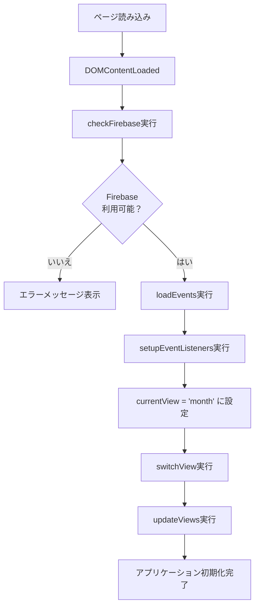
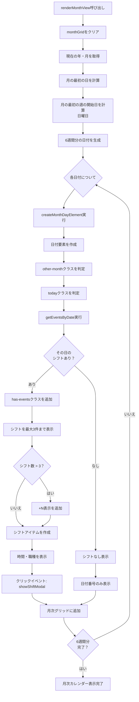
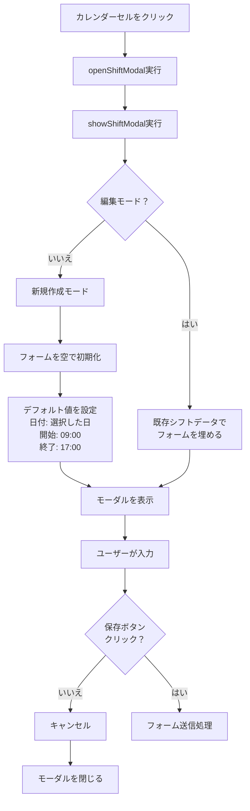
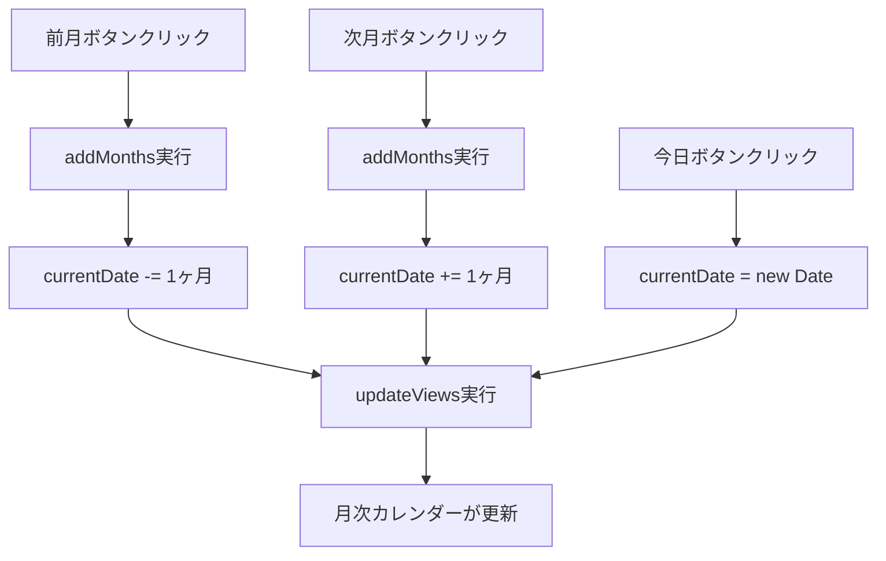
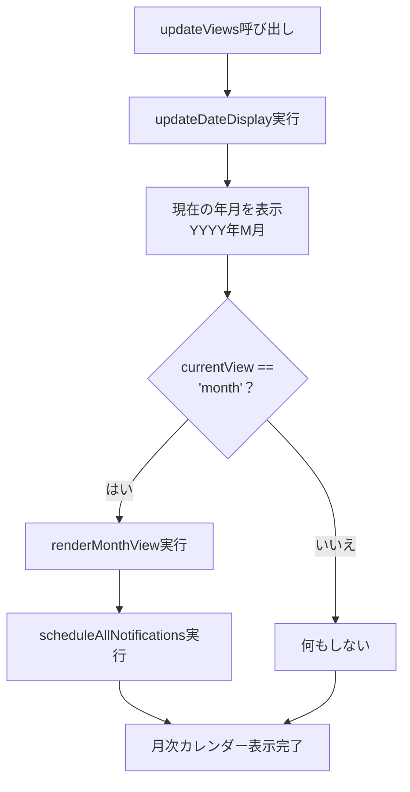
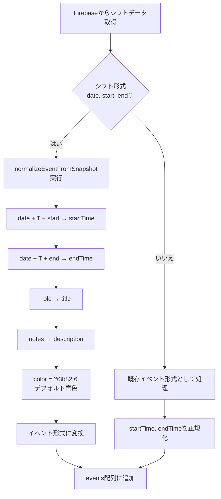

# Part-Time Tracker アプリケーション フローチャート

このドキュメントは、Part-Time Trackerアプリケーションの主要なロジックフローをMermaidを使用して可視化したものです。

## 目次

1. [アプリケーション初期化フロー](#アプリケーション初期化フロー)
2. [Firebase接続・シフト読み込みフロー](#firebase接続シフト読み込みフロー)
3. [月次カレンダー表示フロー](#月次カレンダー表示フロー)
4. [シフト追加フロー](#シフト追加フロー)
5. [シフトフォーム送信フロー](#シフトフォーム送信フロー)
6. [シフト編集・削除フロー](#シフト編集削除フロー)
7. [月次ナビゲーションフロー](#月次ナビゲーションフロー)
8. [シフトデータ変換フロー](#シフトデータ変換フロー)

---

## アプリケーション初期化フロー



---

## Firebase接続・シフト読み込みフロー

```mermaid
flowchart TD
    A[loadEvents呼び出し] --> B{Firebase<br/>有効？}
    B -->|いいえ| C[エラーメッセージ表示]
    B -->|はい| D[既存リスナーを解除]
    D --> E[ref: /shifts]
    E --> F[初回: 全件取得]
    F --> G{データ<br/>存在？}
    G -->|いいえ| H[events = []]
    G -->|はい| I[normalizeEventFromSnapshot実行]
    I --> J{シフト形式<br/>date, start, end？}
    J -->|はい| K[シフトデータをイベント形式に変換]
    J -->|いいえ| L[既存イベント形式として処理]
    K --> M[date + T + start → startTime]
    M --> N[date + T + end → endTime]
    N --> O[role → title]
    O --> P[notes → description]
    P --> Q[日付範囲でフィルタリング]
    L --> Q
    Q --> R[開始時刻でソート]
    R --> S[events配列に設定]
    H --> T[updateViews実行]
    S --> T
    T --> U[scheduleAllNotifications実行]
    U --> V[リアルタイムリスナー設定]
    V --> W[onChildAdded: シフト追加を検知]
    V --> X[onChildChanged: シフト更新を検知]
    V --> Y[onChildRemoved: シフト削除を検知]
    W --> Z[events配列に追加]
    X --> AA[events配列を更新]
    Y --> AB[events配列から削除]
    Z --> AC[updateViews実行]
    AA --> AC
    AB --> AC
```

---

## 月次カレンダー表示フロー



---

## シフト追加フロー



---

## シフトフォーム送信フロー

```mermaid
flowchart TD
    A[フォーム送信] --> B[preventDefault]
    B --> C[フォームデータを取得]
    C --> D[date, start, end, role, rate, notes]
    D --> E{必須項目<br/>入力済み？}
    E -->|いいえ| F[エラー: 日付・開始・終了は必須]
    E -->|はい| G[開始時刻・終了時刻を結合]
    G --> H[startTime = date + T + start]
    H --> I[endTime = date + T + end]
    I --> J[労働時間を計算]
    J --> K[durationHours = endTime - startTime]
    K --> L[totalPay = rate * durationHours]
    L --> M[シフトデータをイベント形式に変換]
    M --> N{編集モード？}
    N -->|いいえ| O[addEvent実行]
    N -->|はい| P[updateEvent実行]
    O --> Q[Firebase: /shifts に追加]
    P --> R[Firebase: /shifts/{id} を更新]
    Q --> S[リアルタイムリスナーが検知]
    R --> S
    S --> T[events配列を更新]
    T --> U[updateViews実行]
    U --> V[月次カレンダーが更新]
    V --> W[モーダルを閉じる]
    W --> X[成功メッセージ表示]
    F --> Y[エラーメッセージ表示]
```

---

## シフト編集・削除フロー

```mermaid
flowchart TD
    A[シフトアイテムをクリック] --> B[showShiftModal実行]
    B --> C[編集モードでモーダルを開く]
    C --> D[既存シフトデータでフォームを埋める]
    D --> E[deleteBtnを表示]
    E --> F{操作を選択}
    F -->|編集| G[フォームを編集]
    F -->|削除| H[削除ボタンをクリック]
    G --> I[フォーム送信]
    I --> J[updateEvent実行]
    J --> K[Firebase: /shifts/{id} を更新]
    K --> L[リアルタイムリスナーが検知]
    L --> M[events配列を更新]
    M --> N[updateViews実行]
    N --> O[月次カレンダーが更新]
    H --> P[showConfirmModal実行]
    P --> Q{確認<br/>OK？}
    Q -->|いいえ| R[キャンセル]
    Q -->|はい| S[deleteEvent実行]
    S --> T[Firebase: /shifts/{id} を削除]
    T --> U[リアルタイムリスナーが検知]
    U --> V[events配列から削除]
    V --> W[updateViews実行]
    W --> X[月次カレンダーが更新]
    X --> Y[モーダルを閉じる]
    Y --> Z[成功メッセージ表示]
    R --> AA[モーダルを閉じない]
    O --> Y
```

---

## 月次ナビゲーションフロー



---

## 月次ビュー更新フロー



---

## シフトデータ変換フロー



---

## 主要なデータ構造

### シフトデータ（Firebase保存形式）

```javascript
{
  date: "2024-01-15",        // 日付（YYYY-MM-DD）
  start: "09:00",            // 開始時間（HH:MM）
  end: "17:00",              // 終了時間（HH:MM）
  role: "レストラン",         // 職種/場所
  rate: 1200,                // 時給
  notes: "メモ",              // メモ
  durationHours: 8.0,        // 労働時間（時間）
  totalPay: 9600,            // 合計給与
  createdAt: "2024-01-15T00:00:00.000Z",
  updatedAt: "2024-01-15T00:00:00.000Z"
}
```

### イベント形式（内部処理形式）

```javascript
{
  id: "abc123",
  date: "2024-01-15",
  start: "09:00",
  end: "17:00",
  role: "レストラン",
  rate: 1200,
  notes: "メモ",
  title: "レストラン",        // roleから変換
  description: "メモ",        // notesから変換
  startTime: "2024-01-15T09:00",  // date + T + start
  endTime: "2024-01-15T17:00",    // date + T + end
  color: "#3b82f6",          // デフォルトの青色
  durationHours: 8.0,
  totalPay: 9600,
  createdAt: "2024-01-15T00:00:00.000Z",
  updatedAt: "2024-01-15T00:00:00.000Z"
}
```

---

## 補足説明

### キーポイント

1. **リアルタイム同期**: Firebase Realtime Databaseを使用して、データ変更が即座に反映されます。
2. **月次ビューのみ**: 日次ビューと週次ビューは削除され、月次ビューのみを表示します。
3. **シフト管理**: シフトの追加・編集・削除が可能です。
4. **データ変換**: Firebase保存形式（date, start, end）と内部処理形式（startTime, endTime）を自動変換します。
5. **Google Syncなし**: Googleカレンダー同期機能は削除されています。
6. **Firebaseパス**: すべてのデータは`/shifts`パスに保存されます。

---

## 作成日

2024年12月
